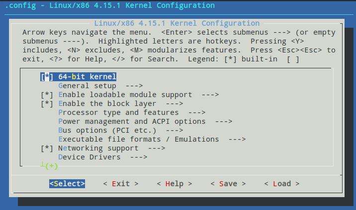

# Log Week 12

## Kernel Compilation & Boot Sequence

Pada Week ini saya mempelajari cara meng-compile sendiri dari binary linux itu sendiri langsung dari binary yang disediakan dan meng-installnya ke dalam device  yang saya miliki (Saya menggunakan Virtual Box sebagai device).


Saya mendownload linux kernel tersebut dengan wget lalu saya dan mengesktarknya menggunakan command tar

```bash
wget http://kambing.ui.ac.id/linux/v4.x/linux-4.15.1.tar.xz
tar -xvJf linux-4.15.1.tar.xz
```


Sebelum saya melakukan kompilasi kernel, terdapat beberapa dependencies yang diperlukan berikut command untuk meng-install yang diperlukan

```bash
sudo apt-get install kernel-package libncurses5-dev flex bison libssl-dev build-essential
```

Sebelum melakukan kompilasi kernel, laukan pengaturan config fitur-fitur mana saja yang akan diimplementasikan dan bagaimana fitur tersebut dimplementasikan.

```bash
make menuconfig
```

Tampilan yang akan muncul akan terlihat seperti ini:



Gunakan arrow key sebagai navigasi dan berikut yang dapat lakukan di dalam menuconfig:

- Menekan tombol Y pada suatu feature artinya feature tersebut akan feature tersebut akan dikompilasi ke dalam kernel sebagai bagian dari kernel
- Menekan tombol M pada suatu feature artinya feature tersebut akan feature tersebut akan dikompilasi menjadi sebuah modul, terpisah dari kernel.
- Menekan tombol N pada suatu feature artinya feature tersebut tidak akan dikompilasi.

Makna Simbol-simbol pada menuconfig:


| Symbol | Arti                                                         |
| ------ | ------------------------------------------------------------ |
| < >    | Tidak ada dependencies                                       |
| [ ]    | Sebuah dependencies memerlukan feature ini untuk di-compile kedalam kernel atau tidak di-compile |
| { }    | Sebuah dependencies memerlukan feature ini untuk di-compile kedalam kernel atau tidak di-compile sebagai module terpisah dari kernel |
| - -    | Sebuah dependencies memerlukan feature ini untuk di-compile kedalam kernel |


Seteleh melakukan config sudah terkonfigurasi, maka lakukan kompilasi pada kernel

```bash
export CONCURRENCY_LmakEVEL=7
make-kpkg clean
```

Lakukan Commad itu di dalam directory/folder linux yang sudah terekstrak tadi. Variabel CONCURRENCY_LmakEVEL sebagai pemebri tahu lecel conccurency pada core processor (Nilai dimasukkan banyak_core_processor -1). make-kpkg clean berfungsi untuk menghapus file hasil kompilasi sebelumnya agar tidak menggangu kompilasi baru yang akan dilakukan. 

```bash
make-kpkg -j jobs --initrd --append-to-version=< you-version-name > kernel_image kernel_headers
```

Command diatas adalh command untuk mengkompilasi, opsi -j yang menyetel berapa jobs yang akan dilakukan secara bersamaan (jobs biasanya diganti dengan jumlah core yang ada). opis --append-to-version bertujuan untuk menamai versi dari kernel custom yang ingin di-compile


Hasil Compile akan menhasilkan dua deb file selangkah diluar directory binary kernel, yaitu:

- kernel_image untuk membuat kernel dan module-nya
- kernel_headers untuk membuat semua file header dalam kernel


Kedua file tersebut lalu diinstall menggunakan command dpkg

```
dpkg -i kernel_image_file.deb
dpkg -i kernel_headers_file.deb
```

Saat mengkonfigurasi menuconfig, terdapat beberapa fitur yang dijasikan modul, maka lakukan penginstalan modul tersebut dengan command:

```bash
make modules_install
```

Lakukan Commad ini di dalam folder binary kernel.


Lalu hal yang dilakukan adalah melakukan melakukan update-initframfs, kompilasi file tersebut menghasilkan beberapa file dalam directory /boot yang berkaitan dengan seperti **initrd, System.map, dan vmlinuz kernel custom** yang dibuat.


Lakukan update initramfs untuk memasukkan seeting boot pada kernel custom yang baru

```bash
update-initramfs -c -k vmlinuz-kernel-version
```

Update-initramfs bertujuan untuk membuat image initframs baru yang dibutuhkan untuk proses booting kernel kita. Initramfs(initial RAM file system) dan initrd(initial ramdisk) merupakan image early file system pertama untuk proses awal booting dari system seperti mounting root file system yang ada di dalam. Screenchot diatas menunjukkan kita membuat initramfs berdasarkan data pada vmlinuz.


Lalu Lakukan update grub, agar seeting image kernel dari initramfs dapat muncul dalam menu bootloader:

```bash 
update-grub
```

